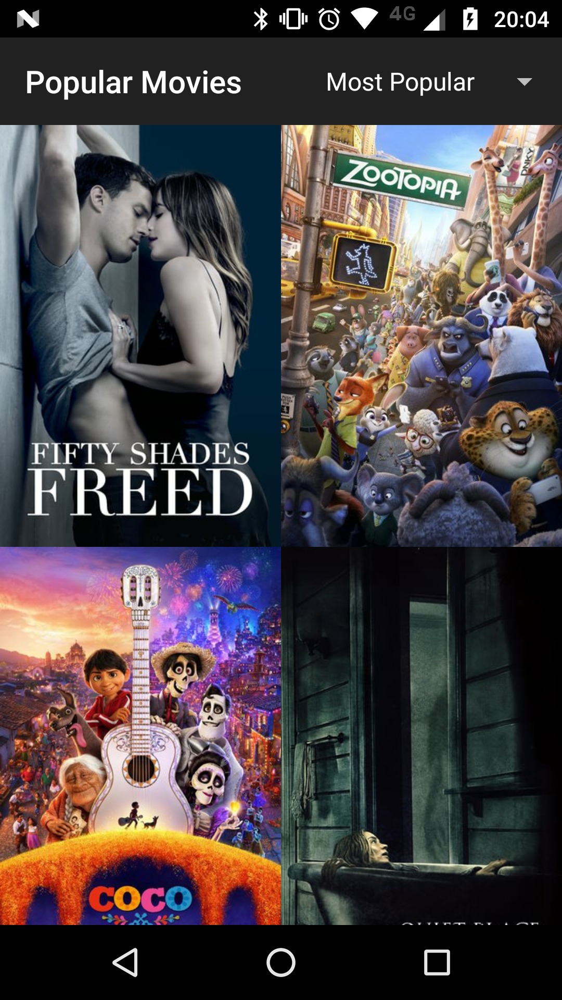

# udacity-popularmovies
Project done for the Udacity Android Nanodegree in 2016.

Students were asked to implement missing parts of the existing app.

Uses TheMovieDb API to fetch the data.
For it to work, you must replace "YOUR_KEY" in the strings.xml file.

